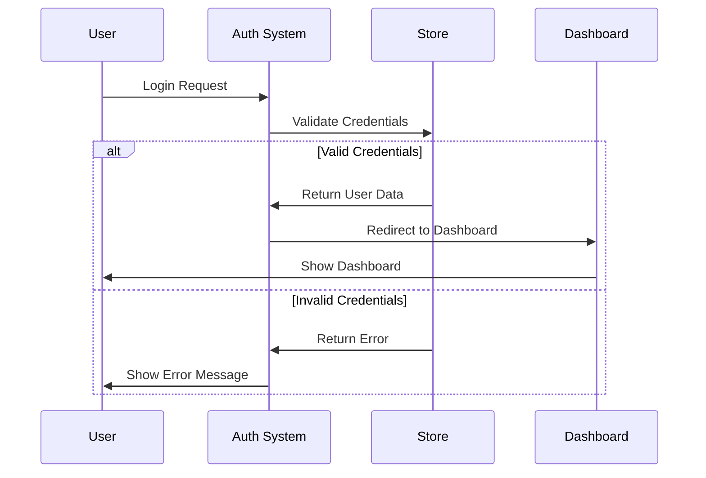
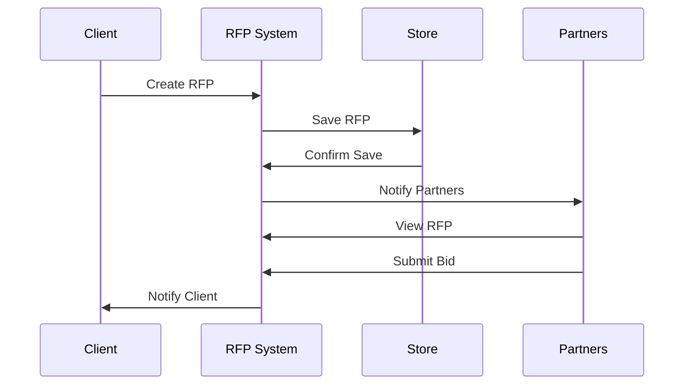
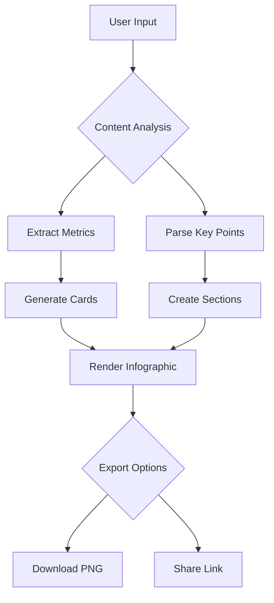
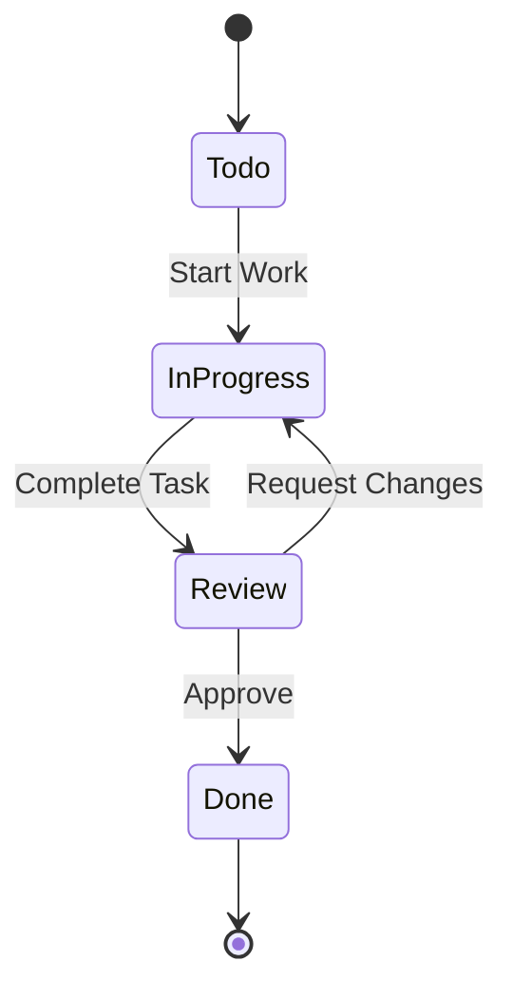
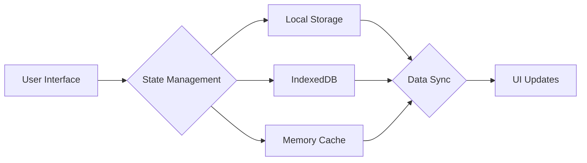
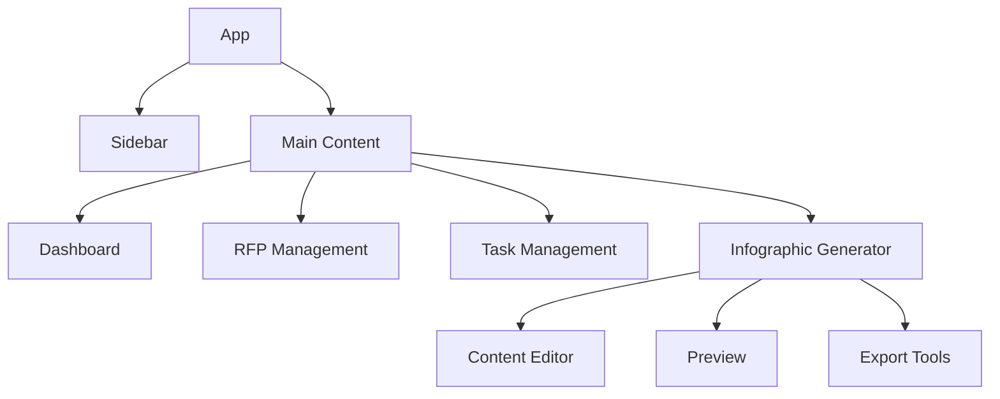
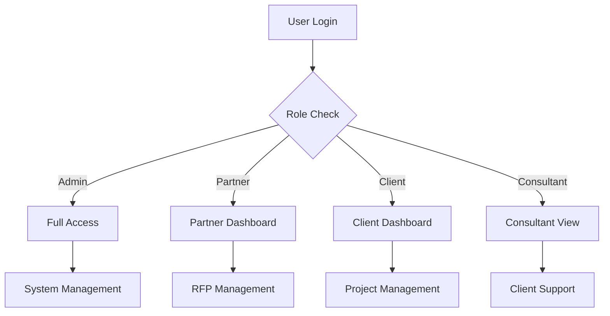
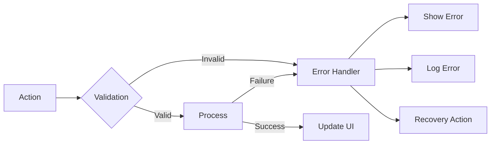
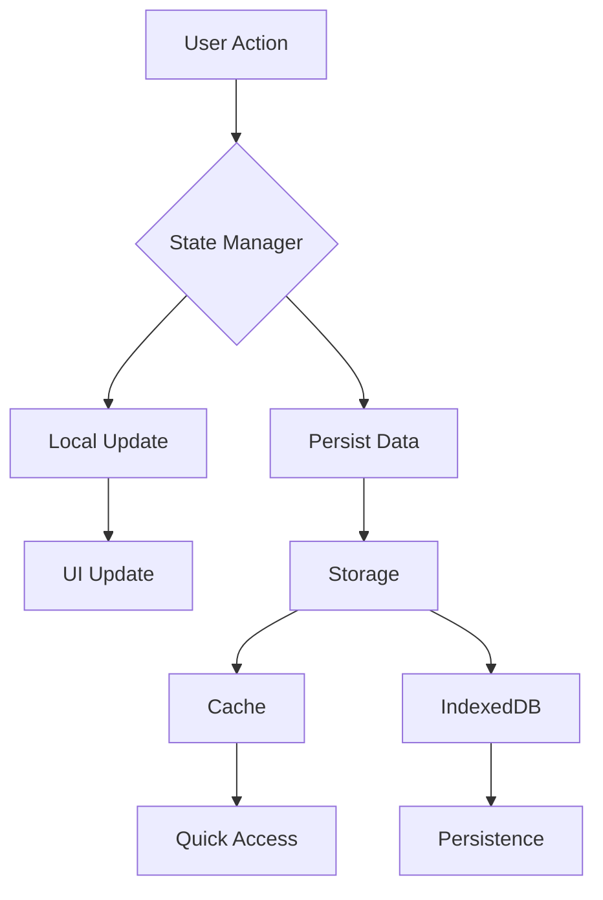

# Application Flow Documentation

## User Authentication Flow

## RFP Creation Flow

## Infographic Generation Flow

## Task Management Flow

## Data Flow Architecture

## Component Hierarchy

## User Role Access Flow

## Error Handling Flow

## State Update Flow

